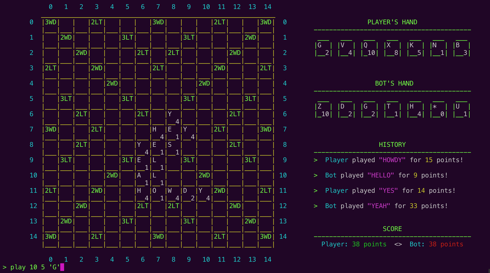

# OScrabbl
OScrabbl is a Scrabble game for the command-line interface developed using (mainly) functional constructs in OCaml. 

Final project submission for Cornell's CS 3110: Functional Programming and Data Structures class, Spring 2020. (Yes, we made this completely remotely during a pandemic.)

> Image of the board in utop

## Contributors
- [Tim Tran](https://github.com/tacascer) 
- [David Kim](https://github.com/TrueshotBarrage)

## How to play
Please check the [instructions](INSTALL.md) here.

## Functionality
- `make`: Runs OCaml's `utop` with the necessary build files.
- `make test`: Runs the test suite. Feel free to test other functions as necessary.
- `make clean`: Cleans the documentation from `make docs`, the zip file created using `make zip`, and/or the build files. 

## Changelog
- May 8th, 2020: Initial release!
  - Fully functional game release, with a working command-line interface GUI. 
  - Currently uses REPL, rather than the promised Lwt I/O with clickable features.

## Planned features
- Lwt I/O support with clickable features in the command-line
- Super smart bot to beat you every time

## Known bugs
- None as of yet! Please feel free to report bugs if you find any in the **Issues** section.
